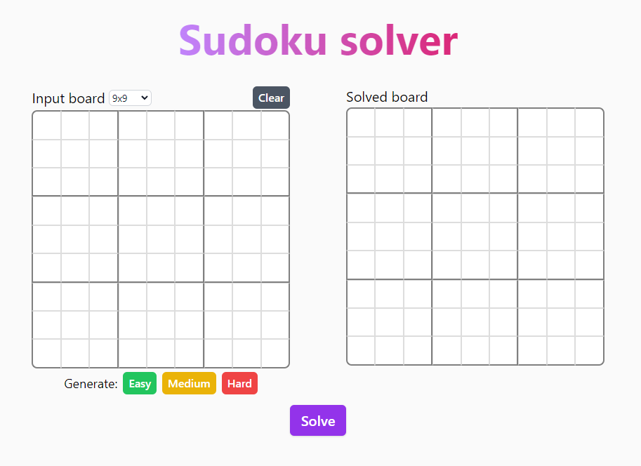
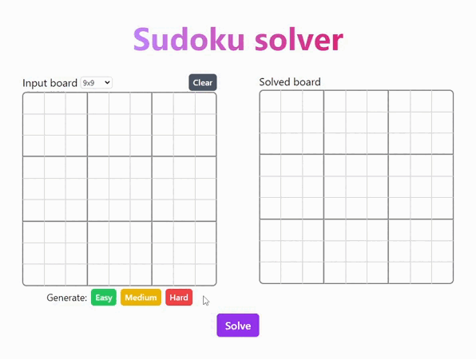
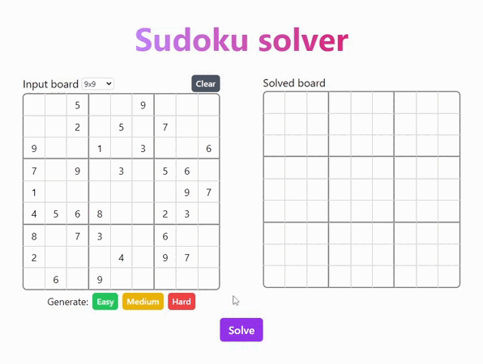

<p align="center">
  
</p>
<h1 align="center">Sudoku Solver</h1>

This is a sudoku solver/generator with support of different board sizes.  
Backend written using Python, Flask and Marshmallow. Frontend written using vanilla JavaScript and Tailwind CSS.

## Features

* REST API
* Sudoku validating with invalid cells highlighting
* Support for different board sizes
* Strict request validation using [Marshmallow](https://github.com/marshmallow-code/marshmallow/)
* Web server using [Gunicorn](https://github.com/benoitc/gunicorn)
* Docker containter with PyPy

## Online demo

You can test this application on this url [185.233.203.127:8000](http://185.233.203.127:8000/).  
Note that this particular instance is strictly limited in resource usage, so don't use large board sizes, as it may face a worker timeout of 30 seconds.

## How to run

A few methods for example:
* Using docker (recommended)
    ```
    docker compose up -d
    ```
* Using flask development server  
    ```
    pip install -r requirements.txt  
    flask --app main run
    ```

## Gallery
Main page:  


Sudoku generation and solving:  


Sudoku validation:  
